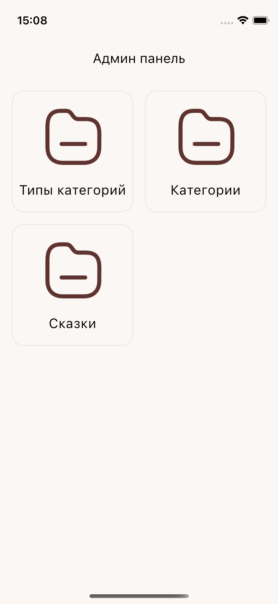
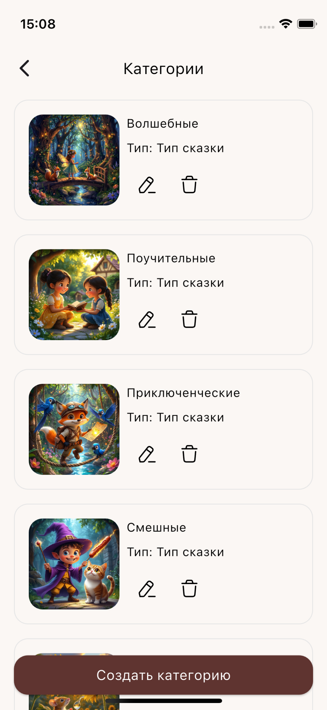
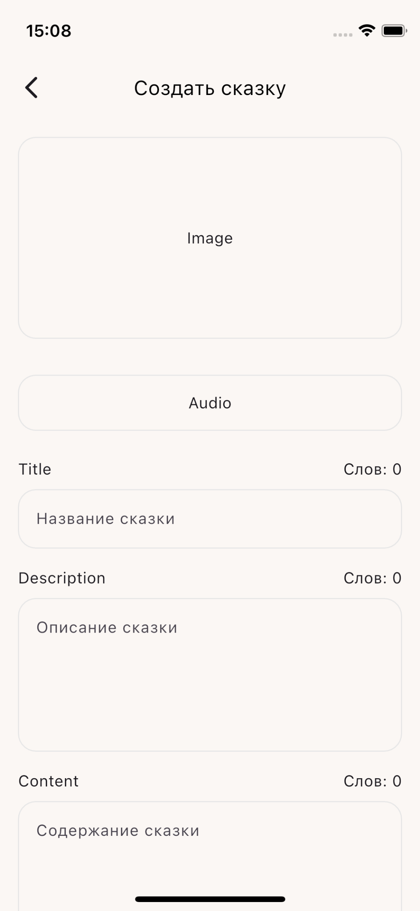

## Stories Admin

Stories Admin — мобильное приложение на Flutter для iOS и Android, часть экосистемы “Сказки для детей”. Позволяет администраторам управлять сказками, категориями и типами категорий прямо с телефона или планшета.

## Скриншоты

<p align="center">
  
  
  
  
</p>

## Описание

Приложение подключается к Stories Server через REST API и использует общий пакет stories_data для моделей данных. Разработано с использованием чистой архитектуры, шаблона BLoC, внедрения зависимостей через get_it и маршрутизации на GoRouter.

## Архитектура и структура проекта

```
lib
 ┣ config
 ┃ ┣ UI
 ┃ ┃ ┣ app_assets.dart
 ┃ ┃ ┣ app_colors.dart
 ┃ ┃ ┣ app_text_style.dart
 ┃ ┃ ┗ app_theme.dart
 ┃ ┗ router
 ┃ ┃ ┣ router.dart
 ┃ ┃ ┗ routers.dart
 ┣ core
 ┃ ┗ functions
 ┃ ┃ ┣ di_stories_admin.dart
 ┃ ┃ ┗ sort_category_types.dart
 ┣ data
 ┃ ┗ services
 ┃ ┃ ┗ permission_service.dart
 ┣ presentation
 ┃ ┣ bottom_sheet
 ┃ ┃ ┗ sheet_delete.dart
 ┃ ┣ screens
 ┃ ┃ ┣ categories
 ┃ ┃ ┃ ┣ bloc
 ┃ ┃ ┃ ┃ ┣ categories_bloc.dart
 ┃ ┃ ┃ ┃ ┣ categories_event.dart
 ┃ ┃ ┃ ┃ ┗ categories_state.dart
 ┃ ┃ ┃ ┗ categories_screen.dart
 ┃ ┃ ┣ categories_types
 ┃ ┃ ┃ ┣ bloc
 ┃ ┃ ┃ ┃ ┣ categories_types_bloc.dart
 ┃ ┃ ┃ ┃ ┣ categories_types_event.dart
 ┃ ┃ ┃ ┃ ┗ categories_types_state.dart
 ┃ ┃ ┃ ┗ categories_types_screen.dart
 ┃ ┃ ┣ category_create
 ┃ ┃ ┃ ┣ bloc
 ┃ ┃ ┃ ┃ ┣ category_create_bloc.dart
 ┃ ┃ ┃ ┃ ┣ category_create_event.dart
 ┃ ┃ ┃ ┃ ┗ category_create_state.dart
 ┃ ┃ ┃ ┗ category_create_screen.dart
 ┃ ┃ ┣ category_type_create
 ┃ ┃ ┃ ┣ bloc
 ┃ ┃ ┃ ┃ ┣ category_type_create_bloc.dart
 ┃ ┃ ┃ ┃ ┣ category_type_create_event.dart
 ┃ ┃ ┃ ┃ ┗ category_type_create_state.dart
 ┃ ┃ ┃ ┗ category_type_create_screen.dart
 ┃ ┃ ┣ category_type_update
 ┃ ┃ ┃ ┣ bloc
 ┃ ┃ ┃ ┃ ┣ category_type_update_bloc.dart
 ┃ ┃ ┃ ┃ ┣ category_type_update_event.dart
 ┃ ┃ ┃ ┃ ┗ category_type_update_state.dart
 ┃ ┃ ┃ ┗ category_type_update_screen.dart
 ┃ ┃ ┣ category_update
 ┃ ┃ ┃ ┣ bloc
 ┃ ┃ ┃ ┃ ┣ category_update_bloc.dart
 ┃ ┃ ┃ ┃ ┣ category_update_event.dart
 ┃ ┃ ┃ ┃ ┗ category_update_state.dart
 ┃ ┃ ┃ ┗ category_update_screen.dart
 ┃ ┃ ┣ home
 ┃ ┃ ┃ ┗ home_screen.dart
 ┃ ┃ ┣ stories
 ┃ ┃ ┃ ┣ bloc
 ┃ ┃ ┃ ┃ ┣ stories_bloc.dart
 ┃ ┃ ┃ ┃ ┣ stories_event.dart
 ┃ ┃ ┃ ┃ ┗ stories_state.dart
 ┃ ┃ ┃ ┗ stories_screen.dart
 ┃ ┃ ┣ story
 ┃ ┃ ┃ ┗ story_screen.dart
 ┃ ┃ ┣ story_create
 ┃ ┃ ┃ ┣ bloc
 ┃ ┃ ┃ ┃ ┣ story_create_bloc.dart
 ┃ ┃ ┃ ┃ ┣ story_create_event.dart
 ┃ ┃ ┃ ┃ ┗ story_create_state.dart
 ┃ ┃ ┃ ┗ story_create_screen.dart
 ┃ ┃ ┗ story_update
 ┃ ┃ ┃ ┣ bloc
 ┃ ┃ ┃ ┃ ┣ story_update_bloc.dart
 ┃ ┃ ┃ ┃ ┣ story_update_event.dart
 ┃ ┃ ┃ ┃ ┗ story_update_state.dart
 ┃ ┃ ┃ ┗ story_update_screen.dart
 ┃ ┗ widgets
 ┃ ┃ ┣ app_button.dart
 ┃ ┃ ┣ app_list_tile.dart
 ┃ ┃ ┣ app_list_tile_radio.dart
 ┃ ┃ ┣ app_text_field.dart
 ┃ ┃ ┣ select_audio_storage.dart
 ┃ ┃ ┣ select_icon_storage.dart
 ┃ ┃ ┗ select_image_storage.dart
 ┣ application.dart
 ┗ main.dart
```

## Технический стек:

- Фреймворк: Flutter
- Язык: Dart
- Управление состоянием: BLoC / flutter_bloc
- DI: get_it
- Навигация: go_router
- HTTP клиент: dio
- Работа с окружением: flutter_dotenv
- Модели данных: stories_data (общий пакет)
- Разрешения и системная информация: permission_handler, device_info_plus
- Работа с файлами: file_picker, path_provider
- Кэш изображений: cached_network_image
- Медиа: image_picker (для выбора изображений), select_audio_storage (для аудио)
- UI и иконки: flutter_svg, flutter_launcher_icons
- Структура проекта: Feature-based + Clean Architecture


## Связанные репозитории:

[Серверное приложение](https://github.com/RfMakar/stories_server)  
[Клиентское приложение](https://github.com/RfMakar/stories_client)  
[Админ приложение](https://github.com/RfMakar/stories_admin)  
[Пакет данных](https://github.com/RfMakar/stories_data) 

## Автор
**Максим Макарчук**